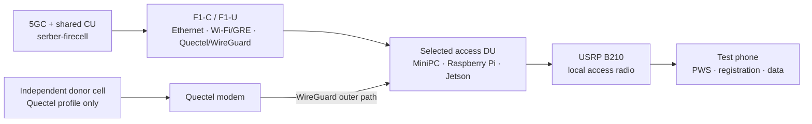

# OAI CU/DU Lab

[](https://github.com/promaaa/oai-cu-du-lab/actions/workflows/reproducibility.yml)
[](https://github.com/promaaa/oai-cu-du-lab/actions/workflows/pages.yml)

Canonical operator and evidence repository for an OpenAirInterface 5G NR CU/DU
split lab. It runs SIB8/Public Warning System experiments across Ethernet,
Wi-Fi/GRE, and Quectel/WireGuard F1 transports while keeping the USRP B210 as
the local access radio.

The repository provides:

- one supported operator entry point: `./oai-lab`;
- a 3 × 3 matrix of access DUs and F1 transports;
- monolithic reference, PWS, registration, data, throughput, and rollback flows;
- pinned source inputs, feature-separated OAI patches, and sanitized evidence
  rules.

> [!IMPORTANT]
> “Supported” means that the workflow exists and has lab evidence. It does not
> mean that every scenario has a fresh full PASS. Check
> [current capability status](docs/STATUS.md) and
> [baseline freshness](docs/BASELINES.md) before relying on a result.

## Repository family

These repositories cover different parts of the same research system:

| Repository | Role |
|---|---|
| **[`promaaa/oai-cu-du-lab`](https://github.com/promaaa/oai-cu-du-lab)** | Canonical deployment, operation, validation, evidence, and rollback source |
| [`promaaa/jetson-kernel-sctp`](https://github.com/promaaa/jetson-kernel-sctp) | Reproducible SCTP-enabled Jetson kernel provisioning; a build-time prerequisite for the Jetson DU |
| [`promaaa/kaust-5G-research`](https://github.com/promaaa/kaust-5G-research) | Research reports, figures, and historical experiment context; not an operational source of truth |
| [OpenAirInterface 5G](https://gitlab.eurecom.fr/oai/openairinterface5g) | External upstream source, fixed to a documented commit and amended only through tracked patches |

Exact revisions and update policy are recorded in
[`reproducibility/dependencies.lock.yaml`](reproducibility/dependencies.lock.yaml)
and the [reproducibility guide](docs/REPRODUCIBILITY.md).

## Architecture



For the Quectel profile, the donor cell serves the modem and the selected
access DU serves the phone. Both DUs must attach to the shared CU; a monolithic
donor gNB alone does not prove the target topology. See
[network and hardware](docs/NETWORK.md) for the authoritative model.

## Supported matrix

| Access DU | Ethernet | Wi-Fi/GRE | Quectel/WireGuard |
|---|:---:|:---:|:---:|
| MiniPC | Supported | Supported | Supported |
| Raspberry Pi | Supported | Supported | Supported |
| Jetson | Supported | Supported | Supported |

The interactive console also exposes the firecell monolithic reference,
runtime status and logs, PWS text updates, clean stop, and Ethernet rollback.

## Requirements

- Node.js 18 or newer; Node.js `24.18.1` is the pinned clean-clone reference
  in [`.node-version`](.node-version)
- OpenSSH and SSH keys for the configured lab hosts
- access to the lab management network
- a private `lab.env`, based on
  [`conf/lab.env.example`](conf/lab.env.example)
- exclusive ownership of the lab before any mutating operation
- exactly one discoverable B210 on the selected radio host, or an explicit
  per-host serial override

## Quick start

```bash
git clone https://github.com/promaaa/oai-cu-du-lab.git
cd oai-cu-du-lab

mkdir -p conf/local
install -m 600 /path/to/lab.env conf/local/lab.env

./oai-lab --check-local-setup
./oai-lab
```

The setup check validates only the local machine and does not contact the lab.
Keep the private environment file outside the clone if preferred:

```bash
./oai-lab --env=/absolute/private/path/lab.env
```

For a new machine or handover, follow the complete
[clean-clone redeployment rehearsal](REDEPLOYMENT.md).

## Common operations

```bash
# Read-only
./oai-lab --check-local-setup
./oai-lab --verify
./oai-lab --status
./oai-lab --logs

# Representative launch profiles
./oai-lab --minipc-ethernet --start-ethernet
./oai-lab --pi-wifi-gre --start-wifi-gre
./oai-lab --jetson-quectel-wg --start-quectel-wg
./oai-lab --start-mono
```

Run `./oai-lab --help` for the complete non-interactive interface. Running
`./oai-lab` without arguments opens the interactive operator console.

> [!CAUTION]
> Launch, stop, and rollback actions change shared lab state. Confirm exclusive
> ownership first, identify the connected radio, and keep the MiniPC Ethernet
> CU/DU configuration available as the rollback baseline.

## Validation and evidence

Static checks prove repository consistency, not radio or phone behavior:

```bash
node scripts/tests/oai-lab-static.test.mjs
node scripts/tests/reproducibility.test.mjs
```

A full scenario PASS requires fresh, sanitized evidence for process and core
health, NG and F1 paths, RF readiness, phone-visible PWS, registration, PDU
session, internet access, timestamped throughput, clean stop, and reproducible
Ethernet rollback. The exact gates and current classifications live in
[baselines](docs/BASELINES.md).

Runtime evidence belongs under
`~/.local/state/oai-cu-du-lab/runs/` (or `OAI_LAB_STATE_DIR`). Only a minimized,
reviewed conclusion should enter tracked documentation.

## Repository map

| Path | Purpose |
|---|---|
| [`oai-lab`](oai-lab) | Supported interactive and non-interactive operator interface |
| [`conf/lab.env.example`](conf/lab.env.example) | Sanitized configuration contract |
| [`patches/`](patches/) | Feature-separated changes applied to pinned external OAI source |
| [`reproducibility/`](reproducibility/) | Machine-readable dependency pins |
| [`docs/`](docs/) | Status, baselines, topology, security, and reproducibility policy |
| [`scripts/tests/`](scripts/tests/) | Static and reproducibility checks |
| [`wiki/`](wiki/) | Operator-oriented procedures and background |

Files under `scripts/lib/` are internal implementation details; automation
should call `./oai-lab`.

## Security boundary

This is a public repository. Never commit:

- UE `Ki`, `OPc`, SIM profiles, or subscriber database secrets;
- passwords, tokens, private keys, or credential-bearing environment files;
- raw logs, packet captures, generated OAI configs, databases, or core dumps.

Local configuration belongs in ignored `conf/local/`; generated configuration
belongs in ignored `conf/generated/` or remote runtime paths. Review
[security and evidence handling](docs/SECURITY.md) before publishing changes.

## Documentation

- [Current capability status](docs/STATUS.md)
- [Baseline freshness and PASS gates](docs/BASELINES.md)
- [Network and hardware topology](docs/NETWORK.md)
- [Security and evidence policy](docs/SECURITY.md)
- [Reproducibility and dependency updates](docs/REPRODUCIBILITY.md)
- [Clean-clone redeployment](REDEPLOYMENT.md)
- [Operator wiki](wiki/index.html)
