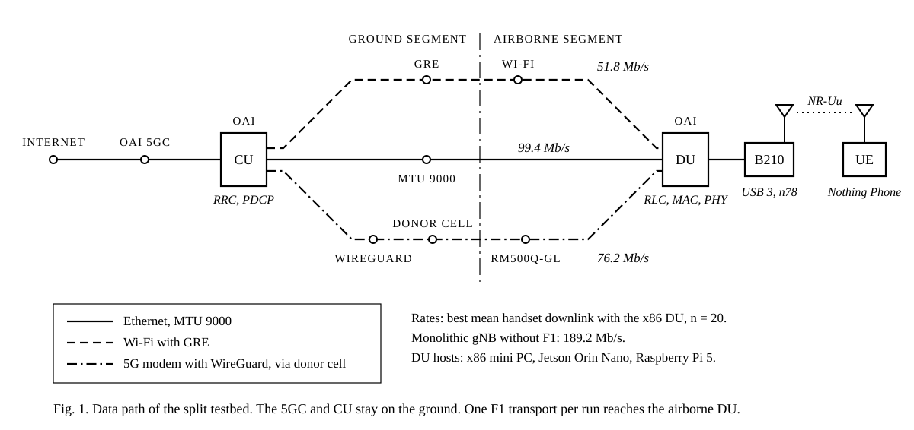
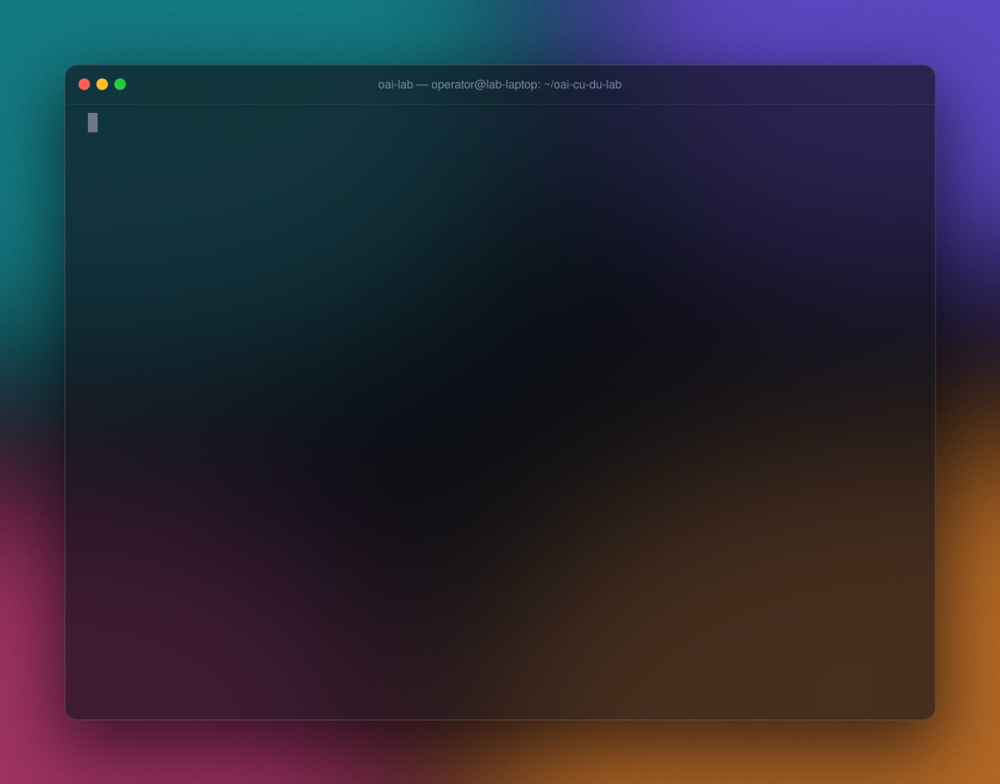
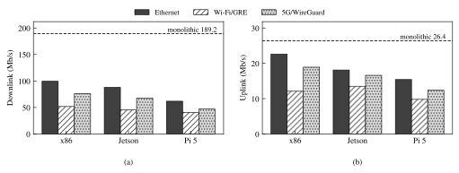

# Toward Lightweight Aerial 5G Cells: A Reproducible Real-Radio OAI Split-DU Testbed on Commodity Arm Platforms

**[Paper (PDF)](docs/PDFs/research-paper.pdf)** · **[Operator console](#quick-start)** · **[Lab notebooks](https://github.com/promaaa/kaust-5G-research)** · **[Jetson SCTP kernel](https://github.com/promaaa/jetson-kernel-sctp)** · **[Lab wiki](https://promaaa.github.io/oai-cu-du-lab/)**

Marc Duboc, Ammar El Falou · SeRBER lab, KAUST · paper submitted, 2026

On a battery-powered UAV cell, every gram and watt spent on radio-access compute comes out of flight time. This testbed keeps the 5G core and the central unit (CU) on the ground and puts only the backhaul endpoint, the distributed unit (DU) and the radio in the air. The question is whether widely available Arm computers can run a real-radio OpenAirInterface 5G DU with useful performance over different F1 links. Raspberry Pi 5 and Jetson Orin Nano DUs drive a USRP B210 in band n78, with a commercial handset. F1 runs over Ethernet, Wi-Fi with GRE, or a Quectel 5G modem with WireGuard.

This repository is everything needed to rerun it: the operator console that deploys, validates and rolls back each configuration, the OpenAirInterface patches (including Public Warning System alerts over F1), configuration templates, the operator wiki and the paper source.



## At a glance



| Category | Configuration |
|---|---|
| Access DUs | MiniPC, Raspberry Pi, Jetson |
| F1 transports | Ethernet, Wi-Fi/GRE, Quectel/WireGuard |
| Access radio | USRP B210 |
| Workflows | Split CU/DU, monolithic reference, PWS updates, validation, rollback |
| Operator interface | `./oai-lab` |

## Results

Mean handset downlink in Mbps, 20 trials per configuration (400 throughput observations in total, downlink and uplink):

| DU | Ethernet F1 | Wi-Fi/GRE F1 | 5G/WireGuard F1 |
|---|---:|---:|---:|
| x86 mini PC | 99.4 | 51.8 | 76.2 |
| Jetson Orin Nano | 87.9 | 45.3 | 67.8 |
| Raspberry Pi 5 | 61.8 | 40.9 | 47.2 |

Monolithic x86 gNB reference: 189.2 Mbps. Uplink ranges from 9.8 to 22.6 Mbps.



- The Jetson keeps 88.4 % of the x86 DU's Ethernet downlink, and 87.5–89.0 % across all three F1 links.
- 5G/WireGuard backhaul keeps 76.4–77.1 % of each host's wired downlink.
- A controlled link-adaptation change raised split-DU downlink from 23.4 to 99.4 Mbps as the dominant MCS moved from 3 to 26.
- The Jetson, B210 and RM500Q-GL modem weigh 657.4 g and draw about 28 W under sustained traffic (757.4 g with an integration allowance).
- A Raspberry Pi 5 DU uses about 1.8 CPU cores and 1.4 GB RAM at 64.8 °C, with no late-packet or overflow markers after thread pinning.
- Public Warning System alerts reach handsets through the split: the CU sends the warning over F1 and the DU broadcasts it in SIB8. To our knowledge this is the first public OpenAirInterface patch for PWS over F1 ([`patches/sib8/`](patches/sib8/)).

Two DUs behind one ground CU were checked as a first step. Larger fan-out and flight tests are future work.

## What's in this repository

| Path | Contents |
|---|---|
| [`oai-lab`](oai-lab), [`scripts/`](scripts/) | Operator console: deploys, validates, monitors and rolls back each DU and F1 transport |
| [`patches/sib8/`](patches/sib8/) | PWS over F1: the CU sends a Write-Replace Warning to the DU, which broadcasts SIB8 |
| [`patches/performance/`](patches/performance/) | DL MCS scheduler instrumentation and a jumbo-frames guide |
| [`patches/rpi-du/`](patches/rpi-du/) | Raspberry Pi DU sample-rate patch for the B210 |
| [`patches/monolithic/`](patches/monolithic/) | Monolithic gNB SIB8 warning and cross-cell verification patches |
| [`conf/`](conf/) | Environment template and a test-only PWS warning profile |
| [`wiki/`](wiki/) | Operator guides, topology, validation and recovery ([online](https://promaaa.github.io/oai-cu-du-lab/)) |
| [`docs/PDFs/`](docs/PDFs/) | Paper PDF, LaTeX source and bibliography |
| [`docs/history/`](docs/history/) | Earlier Quectel backhaul setup |

OpenAirInterface itself stays external and is pinned for each deployment. Weekly lab notebooks are in [kaust-5G-research](https://github.com/promaaa/kaust-5G-research); the SCTP kernel for the Jetson DU is in [jetson-kernel-sctp](https://github.com/promaaa/jetson-kernel-sctp).

## Quick start

Requirements: Node.js 18+, OpenSSH, lab network access, SSH keys, and a private
`lab.env` based on [`conf/lab.env.example`](conf/lab.env.example).

```bash
git clone https://github.com/promaaa/oai-cu-du-lab.git
cd oai-cu-du-lab
mkdir -p conf/local
install -m 600 /path/to/lab.env conf/local/lab.env

./oai-lab --check-local-setup
./oai-lab
```

To keep the environment file outside the clone:

```bash
./oai-lab --env=/absolute/private/path/lab.env
```

## Operator commands

| Task | Command |
|---|---|
| Local preflight | `./oai-lab --check-local-setup` |
| Lab connectivity | `./oai-lab --verify` |
| Current state | `./oai-lab --status` |
| Recent logs | `./oai-lab --logs` |
| Interactive console | `./oai-lab` |

Example non-interactive launch:

```bash
./oai-lab --minipc-ethernet --start-ethernet
```

Run `./oai-lab --help` for every DU, transport, and action.

## Operational safeguards

- Obtain exclusive lab ownership before starting, stopping, or rolling back.
- Confirm the required B210 is connected to the selected radio host.
- Keep MiniPC Ethernet CU/DU available as the rollback baseline.
- Never commit credentials, subscriber data, keys, generated configs, raw
  logs, or packet captures.
- Store runtime evidence under `~/.local/state/oai-cu-du-lab/runs/`.

For detailed procedures, see the [redeployment guide](REDEPLOYMENT.md) and
[operator wiki](wiki/index.html).

## Citation

```bibtex
@unpublished{duboc2026lightweight,
  author = {Duboc, Marc and El Falou, Ammar},
  title  = {Toward Lightweight Aerial 5G Cells: A Reproducible Real-Radio {OAI} Split-{DU} Testbed on Commodity Arm Platforms},
  note   = {Submitted},
  year   = {2026}
}
```

## Context and credits

Research internship at KAUST in Marc Dacier's SeRBER lab (Security Research Bearing Experimental Results), 2026, supervised by Ammar El Falou. Software stack: [OpenAirInterface](https://gitlab.eurecom.fr/oai/openairinterface5g).

## License

Tooling, scripts and wiki: MIT ([LICENSE](LICENSE)). Patches under [`patches/`](patches/) modify OpenAirInterface and are distributed under the OAI Public License v1.1 ([patches/LICENSE](patches/LICENSE)).
