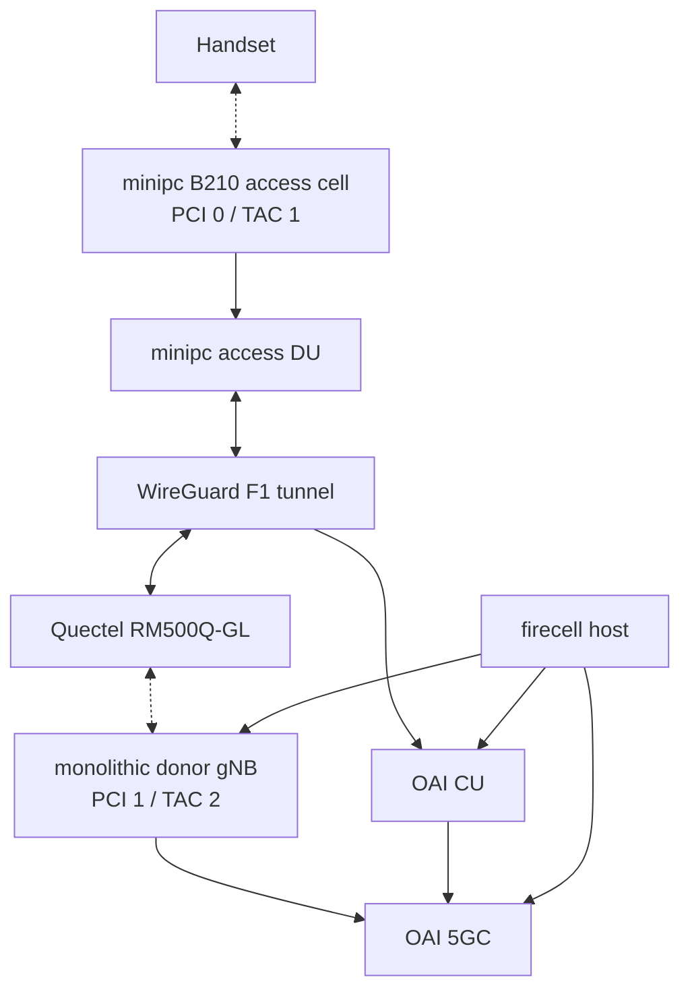

# Quectel 5G F1 backhaul: first working setup

History of the first working F1 backhaul over a Quectel 5G modem, from the former `cu-du-5g-backhauling` repository (now archived). The current, runnable deployment is in this repository's operator console; later throughput work is in [kaust-5G-research](https://github.com/promaaa/kaust-5G-research).

## Result at the time

The working architecture used an independent monolithic donor gNB on the firecell host for the Quectel modem and a separate minipc access DU for the handset.

| Gate | Status |
|---|---|
| Quectel attaches to the donor cell (PCI 1, TAC 2) | PASS |
| WireGuard tunnel over Quectel | PASS |
| Access CU/DU F1-C over the tunnel | PASS |
| Access CU/DU F1-U over the tunnel (bidirectional UDP/2153) | PASS |
| Management isolation: no F1 on Ethernet or Wi-Fi captures | PASS |
| Handset on the access cell (PCI 0, TAC 1) | PASS |
| PWS/SIB8 alert | PASS |
| Handset internet (Fast.com) | PASS, about 5.5 Mb/s |

The setup was functional, but throughput was below the Ethernet CU/DU baseline of the time (about 19–23 Mb/s). Later tuning, described in the paper, raised it substantially.

## Architecture

OpenAirInterface commit used: `102965a669b9444857c27843ec8ce62780bf9d37`.

## Lessons

- Backhauling the Quectel modem through the same cell it serves is recursive and not deployable; the modem must attach to an independent donor cell.
- The handset in the Faraday cage can still prefer the donor cell unless the donor is attenuated enough (a TX attenuation of 24 worked).
- The Quectel PDU address and gateway change between sessions, so scripts must read the live QMI settings and update the WireGuard routes.
- Set the minipc CPU governors to `performance` before starting the access DU.
